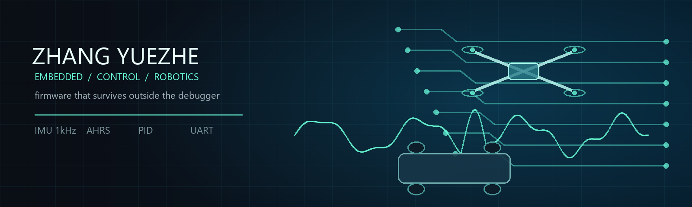
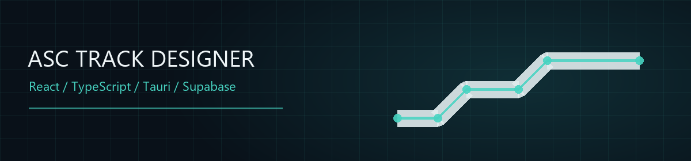
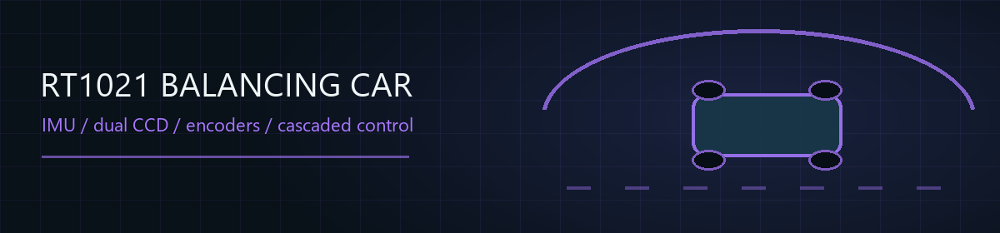
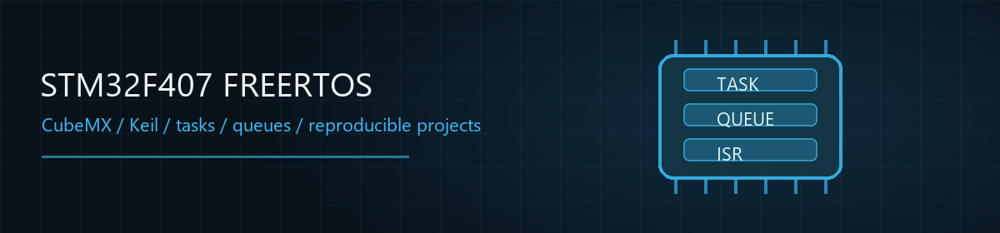

  

<h1 align="center">Zhang Yuezhe / 张跃哲</h1>

  Embedded systems · Control · Robotics 
  杭州电子科技大学自动化专业本科生，专注固件、状态估计与整机调试

  
  

  
  
  
  
  
  
  
  
  
  

## Activity

  

Most recent competition development is kept in private repositories while the event is active.

<picture>
  <source media="(prefers-color-scheme: dark)" srcset="https://raw.githubusercontent.com/ZhangStudyLife/ZhangStudyLife/output/github-contribution-grid-snake-dark.svg" />
  <source media="(prefers-color-scheme: light)" srcset="https://raw.githubusercontent.com/ZhangStudyLife/ZhangStudyLife/output/github-contribution-grid-snake.svg" />
  
</picture>

## Current System

  
  
  
  

Autonomous quadrotor + Mecanum vehicle · telemetry-driven tuning · competition code remains private

## Featured Work

  

  

  

## Open-Source Contributions

  
  
  

  Regression tests · parser diagnostics · configurable middleware

## Now

  Embedded Linux · Rust · stronger test coverage · open-source collaboration 
  HDU Intelligent Car Lab minister · designed embedded onboarding tasks for about 300 applicants

